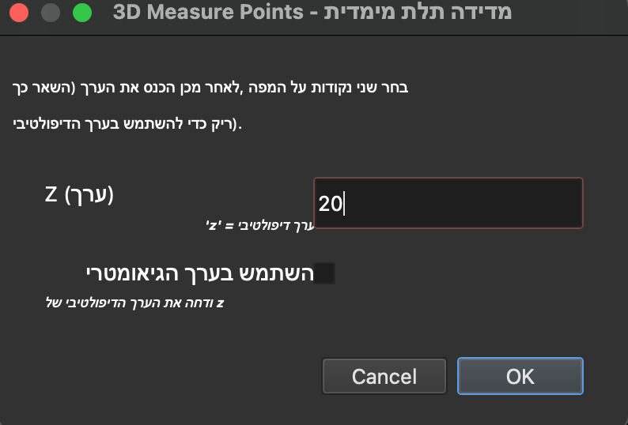

# 3DQGisMeasure

Plugin to Measure the 3D distance between two selected points within the Z Vector Field (PointZ, PointZM)

## איך להריץ

1. Clone or Download the repository
2. Rename the main folder to 3DQGisMeasure
3. Copy 3DQGisMeasure to Qgis's plugin folder
4. Run QGis3.16 and activate the plugin

## תמונות

